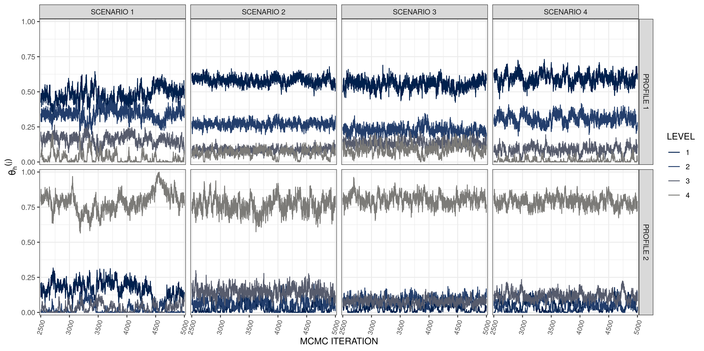
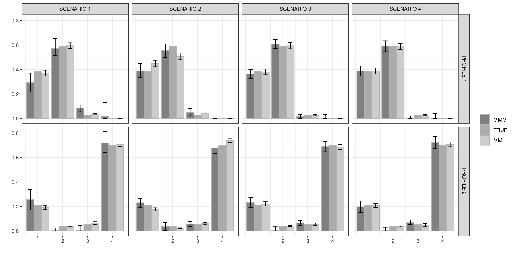
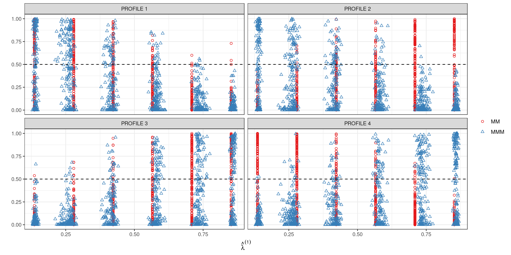

Plots & Tables
==============

We first load the needed libraries

``` r
library(dplyr)
library(reshape2)
library(ggplot2)
library(mvnfast)
library(gridExtra)
library(MCMCpack)
library(knitr)
```

We also need the package <tt>mvtnorm</tt> to be installed for the
function <tt>mvtnorm::pmvnorm</tt>.

We make use of a custom function to load <tt>.Rdata</tt> data object in
named list. The function is taken from
[stackoverflow](https://stackoverflow.com/questions/14757668/combine-multiple-rdata-files-containing-objects-with-the-same-name-into-one-sin)

``` r
loadRData = function(fileName)
{
#loads an RData file, and returns it
    load(fileName)
    get(ls()[ls() != "fileName"])
}
```

Load results & simulated data
-----------------------------

``` r
Scenario1 = c(loadRData('results/Sim1_MMM_results.Rdata'),
              loadRData('results/Sim1_MM_results.Rdata'))

load('simulated_data/Sim1_data_and_true_parameters.Rdata')
Scenario1$data  = data
Scenario1$true_parameter  = true_parameter
rm(data,true_parameter)

Scenario2 = c(loadRData('results/Sim2_MMM_results.Rdata'),
              loadRData('results/Sim2_MM_results.Rdata'))

load('simulated_data/Sim2_data_and_true_parameters.Rdata')
Scenario2$data  = data
Scenario2$true_parameter  = true_parameter
rm(data,true_parameter)

Scenario3 = c(loadRData('results/Sim3_MMM_results.Rdata'),
              loadRData('results/Sim3_MM_results.Rdata'))
        
load('simulated_data/Sim3_data_and_true_parameters.Rdata')
Scenario3$data  = data
Scenario3$true_parameter  = true_parameter
rm(data,true_parameter)
              


Scenario4 = c(loadRData('results/Sim4_MMM_results.Rdata'),
              loadRData('results/Sim4_MM_results.Rdata'))

load('simulated_data/Sim4_data_and_true_parameters.Rdata')
Scenario4$data  = data
Scenario4$true_parameter  = true_parameter
rm(data,true_parameter)
gc()
```

### Plot Scenario 1

``` r
num_of_samp = 1000 ## number of samples

membership_scores = matrix(0,num_of_samp,2)
for(r in (5000 - num_of_samp + 1):5000)
{
 membership_scores[r -(5000 - num_of_samp) , ] = plogis(rmvn(1, mu = Scenario1$mu[r,],sigma = Scenario1$Sigma[r,,]))
}

tmp2 = cbind( rdirichlet(num_of_samp,Scenario1$mixedMem1$alpha)[,2],
          rdirichlet(num_of_samp,Scenario1$mixedMem2$alpha)[,2])


ggdata2 = data.frame(m1= membership_scores[,1],m2 = membership_scores[,2],l1 = tmp2[,1], l2 = tmp2[,2]) 


## bivariate truncated normal density function
dTNORM = function(x,mu,Sig) 
{
    A = c(t(x-mu) %*% solve(Sig) %*% (x-mu))
   return( exp( -0.5*A)/mvtnorm::pmvnorm( lower = c(0,0), upper = c(1,1), mean = mu ,sigma = Sig)[1])
}


xx = seq(0.01,0.99, l = 30)
yy = seq(0.01,0.99, l = 30)
eval_points = expand.grid(xx,yy)
eval_points = cbind(eval_points, value = 
apply(eval_points,1, function(x) dTNORM(x,mu = c(0.5,0.5),
                                       Sig = matrix(c(0.05,0.02,0.02,0.05),2,2))))


plot_scenario1 = 
ggplot(ggdata2) +
geom_contour(aes(Var1,Var2,z = value),bins = 13,data = eval_points,col='grey50',size = 1.0)+
geom_point(aes(m1,m2), alpha = 0.6,size = 0.8) +
geom_point(aes(l1,l2),col =2,shape = 4, alpha = 0.6,size = 0.8) +
scale_x_continuous(breaks = seq(0,1,0.25),labels = sprintf("%.2f" ,seq(0,1,0.25)),expand=c(0.009,0.02))+
scale_y_continuous(breaks = seq(0.25,1,0.25),labels = sprintf("%.2f" ,seq(0.25,1,0.25)),expand=c(0.001,0.001))+
facet_wrap(~I('SCENARIO 1'))+
labs(x  = expression(hat(lambda)^{(1)}),y =  expression(hat(lambda)^{(2)})) + 
theme_bw()
```

### Plot Scenario 2

``` r
membership_scores = matrix(0,num_of_samp,2)

for(r in (5000 - num_of_samp + 1):5000)
{
 membership_scores[r -(5000 - num_of_samp + 1) , ] = plogis(rmvn(1, mu = Scenario2$mu[r,],sigma = Scenario2$Sigma[r,,]))
}

tmp2 = cbind( rdirichlet(num_of_samp,Scenario2$mixedMem1$alpha)[,2],
          rdirichlet(num_of_samp,Scenario2$mixedMem2$alpha)[,2])


ggdata2 = data.frame(m1= membership_scores[,1],m2 = membership_scores[,2],l1 = tmp2[,1], l2 = tmp2[,2]) 


## density function for bivariate logistic normal
dMLND = function(x,mu,Sigma)
{
  logitx = log(x/(1-x))
  
out = 
  1/(sqrt(2*pi*det(Sigma))*prod(x)*prod(1-x))*
  exp( -0.5*( t(logitx  - mu) %*%solve(Sigma) %*% (logitx  - mu)))
return(out)
}

xx = seq(0.01,0.99, l = 100)
yy = seq(0.01,0.99, l = 100)
eval_points = expand.grid(xx,yy)
eval_points = cbind(eval_points, value = 
apply(eval_points,1, function(x) dMLND(x,mu = Scenario2$true_parameter$mu,
                                       Sigma = Scenario2$true_parameter$Sigma)))


plot_scenario2 = 
ggplot(ggdata2) +
geom_contour(aes(Var1,Var2,z = value),bins = 150,data = eval_points,col='grey50',size = 1.0)+
geom_point(aes(m1,m2), alpha = 0.6,,size = 0.8) +
geom_point(aes(l1,l2),col =2,shape = 4,  alpha = 0.6,size = 0.8) +
scale_x_continuous(breaks = seq(0,1,0.25),labels = sprintf("%.2f" ,seq(0,1,0.25)),expand=c(0.009,0.02))+
scale_y_continuous(breaks = seq(0.25,1,0.25),labels = sprintf("%.2f" ,seq(0.25,1,0.25)),expand=c(0.002,0.002))+
facet_wrap(~I('SCENARIO 2'))+
labs(x  = expression(hat(lambda)^{(1)}),y =  expression(hat(lambda)^{(2)})) + 
theme_bw()
```

### Plot Scenario 3

``` r
membership_scores = matrix(0,num_of_samp,2)
for(r in (5000 - num_of_samp + 1):5000)
{
 membership_scores[r - (5000 - num_of_samp), ] = plogis(rmvn(1, mu = Scenario3$mu[r,],sigma = Scenario3$Sigma[r,,]))

}

tmp2 = cbind( rdirichlet(num_of_samp,Scenario3$mixedMem1$alpha)[,2],
          rdirichlet(num_of_samp,Scenario3$mixedMem2$alpha)[,2])


ggdata2 = data.frame(m1= membership_scores[,1],m2 = membership_scores[,2],l1 = tmp2[,1], l2 = tmp2[,2]) 


plot_scenario3  =
ggplot(ggdata2) +
geom_abline(intercept = 0, slope = 1,col = "grey50",size=1.0 ) +
geom_point(aes(m1,m2), alpha = 0.6,size = 0.8) +
geom_point(aes(l1,l2),col =2,shape = 4, alpha = 0.6,,size = 0.8) +
scale_x_continuous(breaks = seq(0,1,0.25),labels = sprintf("%.2f" ,seq(0,1,0.25)),expand=c(0.009,0.02))+
scale_y_continuous(breaks = seq(0.25,1,0.25),labels = sprintf("%.2f" ,seq(0.25,1,0.25)),expand=c(0.001,0.001))+
facet_wrap(~I('SCENARIO 3'))+
labs(x  = expression(hat(lambda)^{(1)}),y =  expression(hat(lambda)^{(2)})) + 
theme_bw()
```

### Plot Scenario 4

``` r
membership_scores = matrix(0,num_of_samp,2)
for(r in  (5000 - num_of_samp + 1):5000)
{
 membership_scores[r -(5000 - num_of_samp) , ] = plogis(rmvn(1, mu = Scenario4$mu[r,],sigma = Scenario4$Sigma[r,,]))
}

tmp2 = cbind( rdirichlet(num_of_samp,Scenario4$mixedMem1$alpha)[,2],
          rdirichlet(num_of_samp,Scenario4$mixedMem2$alpha)[,2])


ggdata2 = data.frame(m1= membership_scores[,1],m2 = membership_scores[,2],l1 = tmp2[,1], l2 = tmp2[,2]) 


plot_scenario4 = 
ggplot(ggdata2) +
geom_polygon(aes(x,y),data = data.frame(x=c(0,1,1,0),y=c(0,0,1,1))
,fill = "grey50",alpha = 0.3 ) + 
geom_point(aes(m1,m2), alpha = 0.6,size = 0.8) +
geom_point(aes(l1,l2),col =2,shape = 4, alpha = 0.6,size = 0.8) +
scale_x_continuous(breaks = seq(0,1,0.25),labels = sprintf("%.2f" ,seq(0,1,0.25)),expand=c(0.009,0.02))+
scale_y_continuous(breaks = seq(0.25,1,0.25),labels = sprintf("%.2f" ,seq(0.25,1,0.25)),expand=c(0.001,0.001))+
facet_wrap(~I('SCENARIO 4'))+
labs(x  = expression(hat(lambda)^{(1)}),y =  expression(hat(lambda)^{(2)})) + 
theme_bw()
```

### Merge plots

Following code produces Figure 2 in Section 6 of the paper displayed
below

``` r
tot_plot = arrangeGrob(plot_scenario1,plot_scenario2,plot_scenario3,plot_scenario4)
ggsave(plot = tot_plot,file = "plots/All_membership_distr.png",height = 15,width =20,units = 'cm',dpi = 300)
```


MSE table
---------

``` r
MSE = tibble()

## SCENARIO 1
membership_scores = apply(Scenario1$lambda[2501:5000,,],c(2,3), mean)
err2 =  (membership_scores[,1] - Scenario1$true_parameter$sbj_prob[,1])^2
MSE[1,1] = sprintf("%.3f(%.3f)", mean(err2),sd(err2))

err2 =  (membership_scores[,2] - Scenario1$true_parameter$sbj_prob[,2])^2
MSE[2,1] = sprintf("%.3f(%.3f)", mean(err2),sd(err2))
         
err2 = (Scenario1$lambda.point1[,2] - Scenario1$true_parameter$sbj_prob[,1])^2 
MSE[3,1] = sprintf("%.3f(%.3f)", mean(err2),sd(err2))

err2 = (Scenario1$lambda.point2[,2] - Scenario1$true_parameter$sbj_prob[,2])^2 
MSE[4,1] = sprintf("%.3f(%.3f)", mean(err2),sd(err2))

MSE = cbind(` `=c('MMM g = 1','MMM g = 2','mixedMem g = 1','mixedMem g = 2'),MSE)

names(MSE)[2]  = "SCENARIO 1"
## SCENARIO 2

membership_scores = apply(Scenario2$lambda[2501:5000,,],c(2,3),mean)
err2 =  (membership_scores[,1] - Scenario2$true_parameter$sbj_prob[,1])^2
MSE[1,3] = sprintf("%.3f(%.3f)", mean(err2),sd(err2))

err2 =  (membership_scores[,2] - Scenario2$true_parameter$sbj_prob[,2])^2
MSE[2,3] = sprintf("%.3f(%.3f)", mean(err2),sd(err2))
         
err2 = (Scenario2$lambda.point1[,2] - Scenario2$true_parameter$sbj_prob[,1])^2 
MSE[3,3] = sprintf("%.3f(%.3f)", mean(err2),sd(err2))

err2 = (Scenario2$lambda.point2[,2] - Scenario2$true_parameter$sbj_prob[,2])^2 
MSE[4,3] = sprintf("%.3f(%.3f)", mean(err2),sd(err2))

names(MSE)[3]  = "SCENARIO 2"

## SCENARIO 3

membership_scores = apply(Scenario3$lambda[2501:5000,,],c(2,3),mean)
err2 =  (membership_scores[,1] - Scenario3$true_parameter$sbj_prob[,1])^2
MSE[1,4] = sprintf("%.3f(%.3f)", mean(err2),sd(err2))

err2 =  (membership_scores[,2] - Scenario3$true_parameter$sbj_prob[,2])^2
MSE[2,4] = sprintf("%.3f(%.3f)", mean(err2),sd(err2))
         
err2 = (Scenario3$lambda.point1[,2] - Scenario3$true_parameter$sbj_prob[,1])^2 
MSE[3,4] = sprintf("%.3f(%.3f)", mean(err2),sd(err2))

err2 = (Scenario3$lambda.point2[,2] - Scenario3$true_parameter$sbj_prob[,2])^2 
MSE[4,4] = sprintf("%.3f(%.3f)", mean(err2),sd(err2))


names(MSE)[4]  = "SCENARIO 3"

## SCENARIO 4

membership_scores = apply(Scenario4$lambda[2501:5000,,],c(2,3),mean)
err2 =  (membership_scores[,1] - Scenario4$true_parameter$sbj_prob[,1])^2
MSE[1,5] = sprintf("%.3f(%.3f)", mean(err2),sd(err2))

err2 =  (membership_scores[,2] - Scenario4$true_parameter$sbj_prob[,2])^2
MSE[2,5] = sprintf("%.3f(%.3f)", mean(err2),sd(err2))
         
err2 = (Scenario4$lambda.point1[,2] - Scenario4$true_parameter$sbj_prob[,1])^2 
MSE[3,5] = sprintf("%.3f(%.3f)", mean(err2),sd(err2))

err2 = (Scenario4$lambda.point2[,2] - Scenario4$true_parameter$sbj_prob[,2])^2 
MSE[4,5] = sprintf("%.3f(%.3f)", mean(err2),sd(err2))


names(MSE)[5]  = "SCENARIO 4"


## generate latex table
MSE  %>% knitr::kable(.,booktab = 3,format = 'latex') %>% cat(.,file = 'plots/MSE_sim.tex')
```

The resulting table is

<table>
<colgroup>
<col style="width: 18%" />
<col style="width: 18%" />
<col style="width: 15%" />
<col style="width: 15%" />
<col style="width: 15%" />
<col style="width: 15%" />
</colgroup>
<thead>
<tr class="header">
<th style="text-align: left;"></th>
<th style="text-align: left;">SCENARIO 1</th>
<th style="text-align: left;">SCENARIO 2</th>
<th style="text-align: left;">SCENARIO 3</th>
<th style="text-align: left;">SCENARIO 4</th>
<th style="text-align: left;">SCENARIO 4</th>
</tr>
</thead>
<tbody>
<tr class="odd">
<td style="text-align: left;">MMM g = 1</td>
<td style="text-align: left;">MMM g = 1</td>
<td style="text-align: left;">0.025(0.040)</td>
<td style="text-align: left;">0.023(0.032)</td>
<td style="text-align: left;">0.037(0.045)</td>
<td style="text-align: left;">0.037(0.045)</td>
</tr>
<tr class="even">
<td style="text-align: left;">MMM g = 2</td>
<td style="text-align: left;">MMM g = 2</td>
<td style="text-align: left;">0.029(0.042)</td>
<td style="text-align: left;">0.023(0.036)</td>
<td style="text-align: left;">0.030(0.044)</td>
<td style="text-align: left;">0.030(0.044)</td>
</tr>
<tr class="odd">
<td style="text-align: left;">mixedMem g = 1</td>
<td style="text-align: left;">mixedMem g = 1</td>
<td style="text-align: left;">0.034(0.051)</td>
<td style="text-align: left;">0.043(0.050)</td>
<td style="text-align: left;">0.043(0.049)</td>
<td style="text-align: left;">0.043(0.049)</td>
</tr>
<tr class="even">
<td style="text-align: left;">mixedMem g = 2</td>
<td style="text-align: left;">mixedMem g = 2</td>
<td style="text-align: left;">0.040(0.054)</td>
<td style="text-align: left;">0.033(0.047)</td>
<td style="text-align: left;">0.031(0.042)</td>
<td style="text-align: left;">0.031(0.042)</td>
</tr>
</tbody>
</table>

Kernel plots
------------

### Trace plots

Potentially for our MMM model, as more broadly in mixture models, we may
encounter label switching. This occurs when the extreme profiles change
their meaning across MCMC iterations. We inspected kernel parameters
trace plots to check for the presence of label switching. We show here
the plot for variable `j_sel =1`, reported also in the supplementary
material. All others trace plots can be creates setting `j_sel` value to
1, …, 10.

``` r
j_sel = 1

pdata = Scenario1$kern[1:5000,,,] %>%
        melt %>% 
        rename(samp = Var1,d = Var2, j = Var3, h = Var4) %>%
        filter( j == j_sel) %>%
        mutate(id = 'SCENARIO 1') %>%
        bind_rows(
        Scenario2$kern[1:5000,,,] %>%
        melt %>% 
        rename(samp = Var1,d = Var2, j = Var3, h = Var4) %>%
        filter( j == j_sel) %>%
        mutate(id = 'SCENARIO 2')) %>%
        bind_rows(
        Scenario3$kern[1:5000,,,] %>%
        melt %>% 
        rename(samp = Var1,d = Var2, j = Var3, h = Var4) %>%
        filter(j == 1) %>%
        mutate(id = 'SCENARIO 3')) %>%
        bind_rows(
        Scenario4$kern[1:5000,,,] %>%
        melt %>% 
        rename(samp = Var1,d = Var2, j = Var3, h = Var4) %>%
        filter( j == j_sel) %>%
        mutate(id = 'SCENARIO 4'))

pdata =  pdata %>% filter(samp > 2500)       

pdata$h = as.factor(paste0("PROFILE " ,pdata$h))

  pdata %>%
  ggplot +
  geom_line(aes(x = samp, y = value, color = factor(d))) +
  facet_grid(h~id) + 
  theme_bw() +
  ylim(0,1) +
  scale_x_continuous(expand = c(0.01,0.01))+
  scale_y_continuous(expand = c(0.01,0.01))+
  labs(color = 'LEVEL', x = 'MCMC ITERATION', y = expression({theta[h]}^{(j)}))+
  scale_color_viridis(discrete = TRUE, option = 'E', direction = 1, end =0.5)+
  theme(axis.text.x = element_text(angle = 75, hjust = 1, size=8))+
  ggsave(file = 'plots/kern_trace_plot.png', height = 15, width = 30,units = 'cm')
```



### Plot summaries

#### Scenario 1

``` r
pdata1 = 
Scenario1$kern[2501:5000,,,] %>% melt %>% rename(samp = Var1,d = Var2, j = Var3, h = Var4) %>% group_by(d,j,h) %>% summarize(MMM = median(value),
                                         post_low = quantile(value,0.1),
                                         post_up = quantile(value,0.9)) 
pdata1 = pdata1 %>%
left_join(
Scenario1$true_parameter$kern %>% melt %>% rename( d = Var1, j = Var2, h = Var3,true = value))


pdata1 = pdata1 %>% left_join(
Scenario1$mixedMem1$theta %>% data.table::setattr('dimnames',NULL) %>% melt %>%
    rename(j = Var1, h = Var2, d = Var3,MM = value ) %>%
bind_rows(
Scenario1$mixedMem2$theta %>% data.table::setattr('dimnames',NULL) %>% melt %>%
    rename(j = Var1, h = Var2, d = Var3,MM = value) %>% mutate( j = j+ Scenario1$data$p1)) )


pdata1 = pdata1 %>% left_join(
bind_rows(
left_join(
array(apply(Scenario1$boot_res1$t,2, function(x) quantile(x,prob=0.1)),dim = dim(Scenario1$boot_res1$t0)) %>%
 melt %>% rename(j = Var1, h = Var2, d = Var3,lowMM = value), 

array(apply(Scenario1$boot_res1$t,2, function(x) quantile(x,prob=0.9)),dim = dim(Scenario1$boot_res1$t0)) %>%
    melt %>% rename(j = Var1, h = Var2, d = Var3,upMM = value)),

left_join(
array(apply(Scenario1$boot_res2$t,2, function(x) quantile(x,prob=0.1)),dim = dim(Scenario1$boot_res2$t0)) %>%
 melt %>% rename(j = Var1, h = Var2, d = Var3,lowMM = value), 

array(apply(Scenario1$boot_res2$t,2, function(x) quantile(x,prob=0.9)),dim = dim(Scenario1$boot_res2$t0)) %>%
    melt %>% rename(j = Var1, h = Var2, d = Var3,upMM = value)) %>% 
mutate( j = j+ Scenario1$data$p1))) 
```

#### Scenario 2

``` r
pdata2 = 
Scenario2$kern[2501:5000,,,] %>% melt %>% rename(samp = Var1,d = Var2, j = Var3, h = Var4) %>% group_by(d,j,h) %>% summarize(MMM = median(value),
                                         post_low = quantile(value,0.1),
                                         post_up = quantile(value,0.9)) 
pdata2 = pdata2 %>%
left_join(
Scenario2$true_parameter$kern %>% melt %>% rename( d = Var1, j = Var2, h = Var3,true = value))


pdata2 = pdata2 %>% left_join(
Scenario2$mixedMem1$theta %>% data.table::setattr('dimnames',NULL) %>% melt %>%
    rename(j = Var1, h = Var2, d = Var3,MM = value ) %>%
bind_rows(
Scenario2$mixedMem2$theta %>% data.table::setattr('dimnames',NULL) %>% melt %>%
    rename(j = Var1, h = Var2, d = Var3,MM = value) %>% mutate( j = j+ Scenario2$data$p1)) )


pdata2 = pdata2 %>% left_join(
bind_rows(
left_join(
array(apply(Scenario2$boot_res1$t,2, function(x) quantile(x,prob=0.1)),dim = dim(Scenario2$boot_res1$t0)) %>%
 melt %>% rename(j = Var1, h = Var2, d = Var3,lowMM = value), 

array(apply(Scenario2$boot_res1$t,2, function(x) quantile(x,prob=0.9)),dim = dim(Scenario2$boot_res1$t0)) %>%
    melt %>% rename(j = Var1, h = Var2, d = Var3,upMM = value)),

left_join(
array(apply(Scenario2$boot_res2$t,2, function(x) quantile(x,prob=0.1)),dim = dim(Scenario2$boot_res2$t0)) %>%
 melt %>% rename(j = Var1, h = Var2, d = Var3,lowMM = value), 

array(apply(Scenario2$boot_res2$t,2, function(x) quantile(x,prob=0.9)),dim = dim(Scenario2$boot_res2$t0)) %>%
    melt %>% rename(j = Var1, h = Var2, d = Var3,upMM = value)) %>% 
mutate( j = j+ Scenario2$data$p1))) 
```

#### Scenario 3

``` r
pdata3 = 
Scenario3$kern[2501:5000,,,] %>% melt %>% rename(samp = Var1,d = Var2, j = Var3, h = Var4) %>% group_by(d,j,h) %>% summarize(MMM = median(value),
                                         post_low = quantile(value,0.1),
                                         post_up = quantile(value,0.9)) 
pdata3 = pdata3 %>%
left_join(
Scenario3$true_parameter$kern %>% melt %>% rename( d = Var1, j = Var2, h = Var3,true = value))


pdata3 = pdata3 %>% left_join(
Scenario3$mixedMem1$theta %>% data.table::setattr('dimnames',NULL) %>% melt %>%
    rename(j = Var1, h = Var2, d = Var3,MM = value ) %>%
bind_rows(
Scenario3$mixedMem2$theta %>% data.table::setattr('dimnames',NULL) %>% melt %>%
    rename(j = Var1, h = Var2, d = Var3,MM = value) %>% mutate( j = j+ Scenario3$data$p1)) )


pdata3 = pdata3 %>% left_join(
bind_rows(
left_join(
array(apply(Scenario3$boot_res1$t,2, function(x) quantile(x,prob=0.1)),dim = dim(Scenario3$boot_res1$t0)) %>%
 melt %>% rename(j = Var1, h = Var2, d = Var3,lowMM = value), 

array(apply(Scenario3$boot_res1$t,2, function(x) quantile(x,prob=0.9)),dim = dim(Scenario3$boot_res1$t0)) %>%
    melt %>% rename(j = Var1, h = Var2, d = Var3,upMM = value)),

left_join(
array(apply(Scenario3$boot_res2$t,2, function(x) quantile(x,prob=0.1)),dim = dim(Scenario3$boot_res2$t0)) %>%
 melt %>% rename(j = Var1, h = Var2, d = Var3,lowMM = value), 

array(apply(Scenario3$boot_res2$t,2, function(x) quantile(x,prob=0.9)),dim = dim(Scenario3$boot_res2$t0)) %>%
    melt %>% rename(j = Var1, h = Var2, d = Var3,upMM = value)) %>% 
mutate( j = j+ Scenario3$data$p1))) 
```

#### Scenario 4

``` r
pdata4 = 
Scenario4$kern[2501:5000,,,] %>% melt %>% rename(samp = Var1,d = Var2, j = Var3, h = Var4) %>% group_by(d,j,h) %>% summarize(MMM = median(value),
                                         post_low = quantile(value,0.1),
                                         post_up = quantile(value,0.9)) 
pdata4 = pdata4 %>%
left_join(
Scenario4$true_parameter$kern %>% melt %>% rename( d = Var1, j = Var2, h = Var3,true = value))


pdata4 = pdata4 %>% left_join(
Scenario4$mixedMem1$theta %>% data.table::setattr('dimnames',NULL) %>% melt %>%
    rename(j = Var1, h = Var2, d = Var3,MM = value ) %>%
bind_rows(
Scenario4$mixedMem2$theta %>% data.table::setattr('dimnames',NULL) %>% melt %>%
    rename(j = Var1, h = Var2, d = Var3,MM = value) %>% mutate( j = j+ Scenario4$data$p1)) )


pdata4 = pdata4 %>% left_join(
bind_rows(
left_join(
array(apply(Scenario4$boot_res1$t,2, function(x) quantile(x,prob=0.1)),dim = dim(Scenario4$boot_res1$t0)) %>%
 melt %>% rename(j = Var1, h = Var2, d = Var3,lowMM = value), 

array(apply(Scenario4$boot_res1$t,2, function(x) quantile(x,prob=0.9)),dim = dim(Scenario4$boot_res1$t0)) %>%
    melt %>% rename(j = Var1, h = Var2, d = Var3,upMM = value)),

left_join(
array(apply(Scenario4$boot_res2$t,2, function(x) quantile(x,prob=0.1)),dim = dim(Scenario4$boot_res2$t0)) %>%
 melt %>% rename(j = Var1, h = Var2, d = Var3,lowMM = value), 

array(apply(Scenario4$boot_res2$t,2, function(x) quantile(x,prob=0.9)),dim = dim(Scenario4$boot_res2$t0)) %>%
    melt %>% rename(j = Var1, h = Var2, d = Var3,upMM = value)) %>% 
mutate( j = j+ Scenario4$data$p1))) 
```

#### Total plots

``` r
pdata_tot = bind_rows(cbind.data.frame(pdata1, type = 'SCENARIO 1'),
                      cbind.data.frame(pdata2, type = 'SCENARIO 2'),
                      cbind.data.frame(pdata3, type = 'SCENARIO 3'),
                      cbind.data.frame(pdata4, type = 'SCENARIO 4')
                  )

pdata_tot$h =factor(ifelse(pdata_tot$h ==1,'PROFILE 1', 'PROFILE 2'))


pdata_tot %>% 
 melt(c(1,2,3,5,6,9,10,11)) %>% 
 filter(j==4) ->tmp_data 

tmp_data$post_low[tmp_data$variable =='MM']  = tmp_data$lowMM[tmp_data$variable =='MM'] 

tmp_data$post_up[tmp_data$variable =='MM']  = tmp_data$upMM[tmp_data$variable =='MM'] 


tmp_data$variable = tmp_data$variable %>% as.character %>% toupper %>% factor(., levels = c('MMM','TRUE','MM'))
 
tmp_data$post_low[tmp_data$variable=='TRUE'] = NA
tmp_data$post_up[tmp_data$variable=='TRUE']  = NA
```

Finally we can plot the results

``` r
tmp_data %>% 
 ggplot +
 geom_bar(aes(x = d, y = value,fill = variable),position = position_dodge(),stat = 'identity',col = 'grey70') +
 geom_errorbar(aes(x = d, ymin = post_low, ymax = post_up,group=variable), width=.5,
                 position=position_dodge(.9) ) +
scale_fill_grey(start = 0.5, end = 0.8)+
facet_grid(factor(h)~type)+ 
labs(x = '',y = '', fill = '') + 
theme_bw()
ggsave(file = 'plots/kern_group1.png',height = 15,width = 30,units = 'cm')
```

Previous code produces the figure


We do the same for a variable in group 2

``` r
### GROUP 2 variable
pdata_tot %>% 
 melt(c(1,2,3,5,6,9,10,11)) %>% 
 filter(j==8) ->tmp_data 

tmp_data$post_low[tmp_data$variable =='MM']  = tmp_data$lowMM[tmp_data$variable =='MM'] 

tmp_data$post_up[tmp_data$variable =='MM']  = tmp_data$upMM[tmp_data$variable =='MM'] 


tmp_data$variable = tmp_data$variable %>% as.character %>% toupper %>% factor(., levels = c('MMM','TRUE','MM'))


tmp_data$post_low[tmp_data$variable=='TRUE'] = NA
tmp_data$post_up[tmp_data$variable=='TRUE']  = NA

tmp_data %>% 
 ggplot +
 geom_bar(aes(x = d, y = value,fill = variable),position = position_dodge(),stat = 'identity',col = 'grey70') +
 geom_errorbar(aes(x = d, ymin = post_low, ymax = post_up,group=variable), width=.5,
                 position=position_dodge(.9) ) +
scale_fill_grey(start = 0.5, end = 0.8)+
facet_grid(factor(h)~type)+ 
labs(x = '',y = '', fill = '') + 
theme_bw()
ggsave(file = 'plots/kern_group2.png',height = 15,width = 30,units = 'cm')
```

Having as result 

Misspecification: more than two pure types
------------------------------------------

``` r
Scenario_miss = c(loadRData('results/Sim_miss_MMM_results.Rdata'),
                  loadRData('results/Sim_miss_MM_results.Rdata'))

load('simulated_data/data_and_true_parameters_misspecified.Rdata')
Scenario_miss$data  = data
Scenario_miss$true_parameter  = true_parameter
rm(data,true_parameter)


membership_score = apply(Scenario_miss$lambda[2501:5000,,],c(2,3), mean)

pdata = cbind.data.frame(Scenario_miss$lambda.point1[,2],membership_score[,1], Scenario_miss$true_parameter$sbj_prob[[1]]) 

names(pdata) = c('MM','MMM','PROFILE 1' ,'PROFILE 2','PROFILE 3', 'PROFILE 4')


 pdata %>% melt(c(1,2)) %>% melt(c(3,4)) %>% setNames(c('truth','y','model','x')) %>%  
    ggplot +
    geom_point(aes(x = x, y = y,shape = model,col = model)) + 
    scale_shape(solid = FALSE) + 
    scale_colour_brewer(palette='Set1')+
    scale_x_continuous(limits = c(0,1),expand = c(-0.1,0)) + 
    scale_y_continuous(limits = c(0,1)) +
    facet_wrap(~truth) + 
    geom_hline(yintercept = 0.5, lty = 'dashed') +
    labs(x = expression(hat(lambda)^{(1)}),y = '',col ='',shape = '')+
    theme_bw()
ggsave(file = 'plots/multi_prof.png',height = 15,width = 30,units = 'cm')
```



### Mixed profiles

We can obtain the elements of Table 2 in Section 6 of the paper with the
following code

``` r
## MMM variable 1 profile 1 kernel
Scenario_miss$kern[2501:5000,,1,1] %>%  apply(2, function(x) sprintf("%.3f (%.3f;%.3f)", mean(x),quantile(x,0.1),quantile(x,0.9)))

## MMM variable 1 profile 2 kernel
Scenario_miss$kern[2501:5000,,1,2] %>%  apply(2, function(x) sprintf("%.3f (%.3f;%.3f)", mean(x),quantile(x,0.1),quantile(x,0.9)))

## MM variable 1 profile 1 kernel
Scenario_miss$mixedMem1$theta[1,1,] %>% sapply(function(x) sprintf("%.3f",x))

## MM variable 1 profile 2 kernel
Scenario_miss$mixedMem1$theta[1,2,] %>% sapply(function(x) sprintf("%.3f",x))
```
